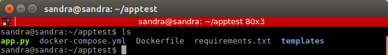
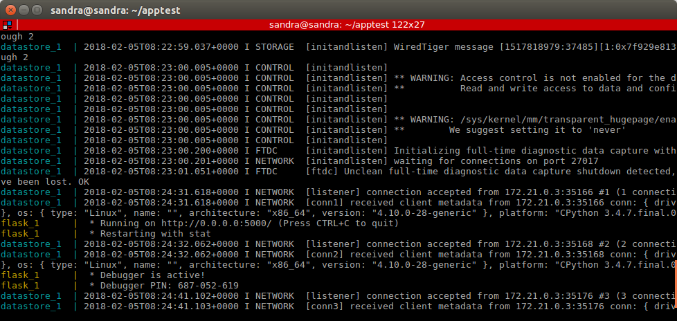

With Docker Compose were created two containers, one for the database and one for the api.

For the api container was used the image of Alpine. The reason is because Alpine is a lighter Linux distribution compared for example to the Ubuntu Docker image. Using the lighter image provides faster build times, because we are only building the dependencies our application needs. 

For the database container mongo's image was selected for many reasons. Mongo is a NoSQL db, it's free, open source, fast and easy to use.Also, it's the most popular NoSQL database so it is a good oportunity to familiarize with this software.

The selected framework for python is Flask due to the many advantages that provides. It is extremely easy to build a simple web app in a single python file. Also, it gives developers a lot of flexibility in how they develop their web applications.

So, using the flask framework, a service in python was created to add new words and to display them after insertion.

Firstly, everything was tested locally to ensure that everything works well together. 

1) Make sure that docker is already installed.

2) Download and install docker compose.

```
sudo curl -L https://github.com/docker/compose/releases/download/1.18.0/docker-compose-`uname -s`-`uname -m` -o /usr/local/bin/docker-compose
```
3)Verify that the installation was successfull.

```
docker-compose --version
```
4) Prepare the project's files which should be (at least) the followings: a Dockerfile, a docker-compose.yml file and a service in python.



In the docker-compose.yml we define all the containers that we wish to build and the links between them. In this case, there are two containers. The first one is called flask and is responsible for the web service. The other one is called datastore where it is specified the selected mongo image.

5) With the following command we start docker compose and we can see in the terimal how all the containers start one by one.

```
sudo docker-compose up
```

If everything goes as expected we should see the following:



6) Next, we can verify that our application is up and running by introducing http://localhost:5000/ (or whatever port is chosen) in the browser. We should see our application running:


To run this multi-container application in Azure cloud you have to follow all the steps that are included in this guide: [link](https://docs.microsoft.com/en-gb/azure/virtual-machines/linux/docker-compose-quickstart).

Following the steps carefully one by one, we can see the application up and running in our vm:


