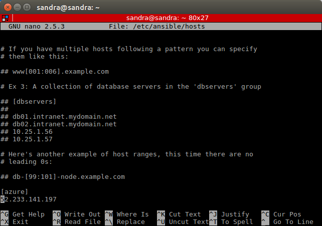
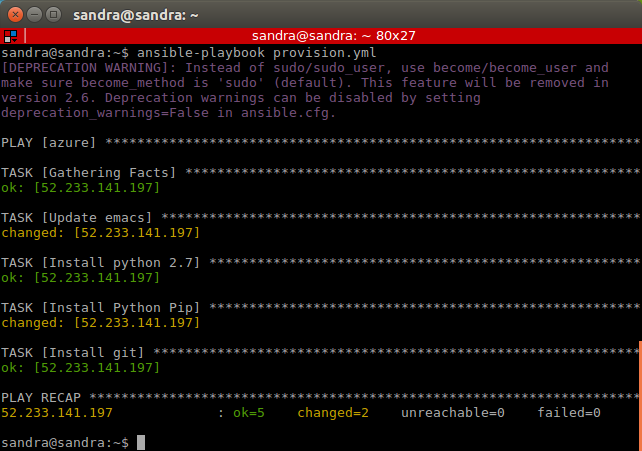

## Hito 2: Provisioning an Ubuntu VM in Azure with Ansible

An Ubuntu 16.04 VM was created through Azure in order to be provised by [Ansible](https://www.ansible.com/) 

First, Python and Ansible were installed on the control machine from which we will be running commands. Ansible cannot run without Python but we will need Python for the development of the project as well.

Then, we add our VM in /etc/ansible/hosts:

[azure]


The next step is to create a playbook named provision.yml with which we will do the provisioning of our VM:

```
---
- hosts: azure
  user: sandra
  sudo: yes
  tasks:
        - name: Update emacs
          apt: pkg=emacs state=present

        - name: Install Python 2.7
          apt: pkg=python2.7 state=present

        - name: Install Python Pip
          apt: pkg=python-pip state=present

        - name: Install git
          apt: pkg=git state=present

```
Last, we execute the playbook with the command:

```
ansible-playbook /etc/ansible/provision.yml
```

and we get the next image which means that everything went well:


